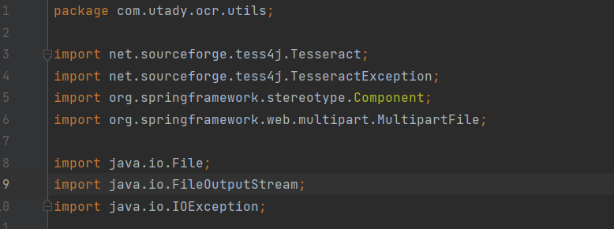
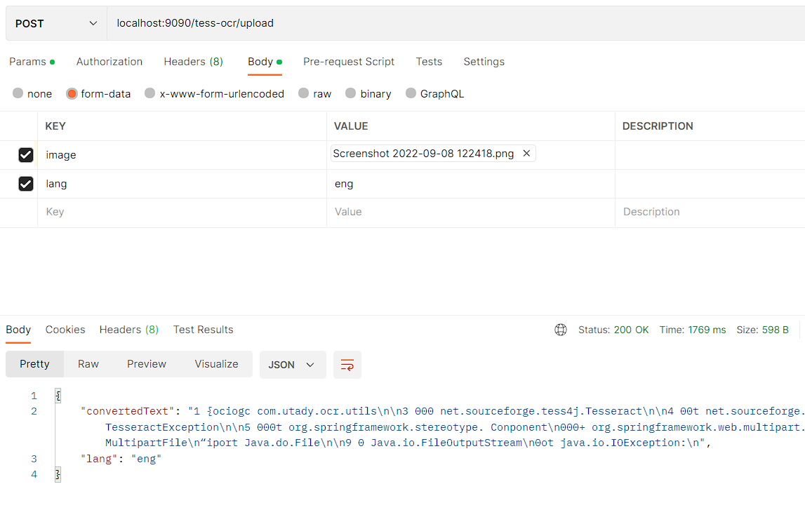

# Tess-ocr

Get Text Extracted from Images with these Formats:

Supported format: TIFF, JPEG, GIF, PNG, and BMP image formats Multi-page TIFF images PDF document format

**Endpoint:**

- **POST Method** : **/tess-ocr/upload**

  Request : in form data put these two values:

    - image (supported image format)
    - lang (language code from supported language)

      current implementation is on tessdata so refer languages in this given link along tessdata

      [Languages supported in different versions of Tesseract](https://tesseract-ocr.github.io/tessdoc/Data-Files-in-different-versions.html)

    **To do:**
    
    - [ ]  Implement auto language detection
    - [ ]  In-Place Image translation

**Example:**

Test-Image:

**Result:**

